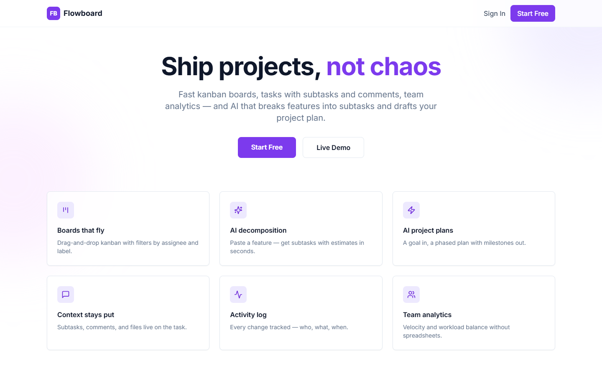
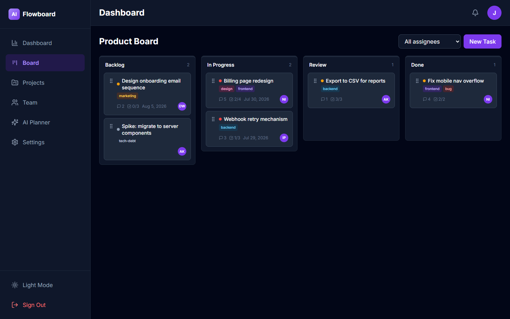
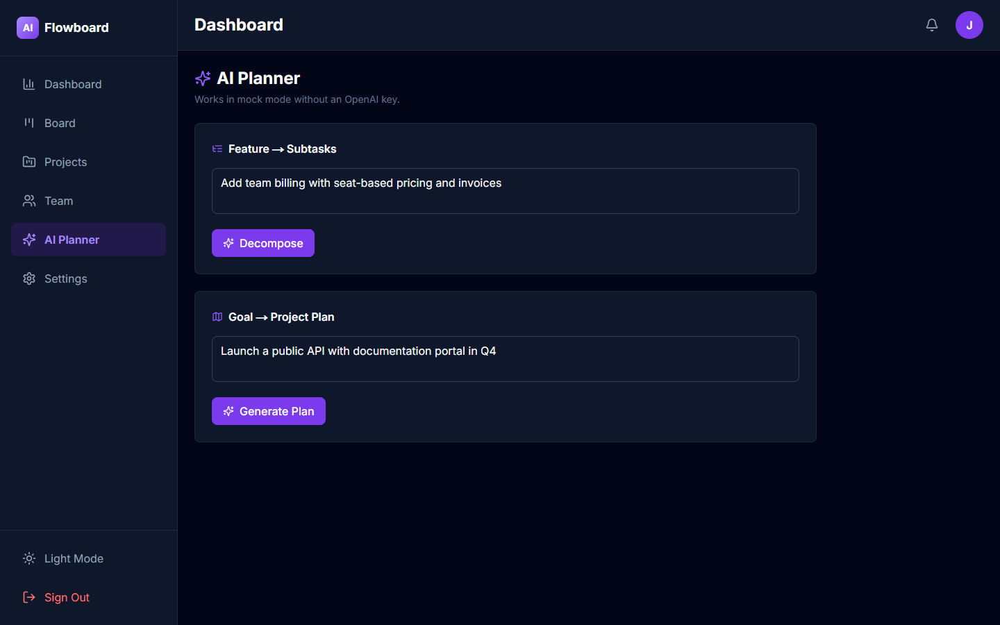
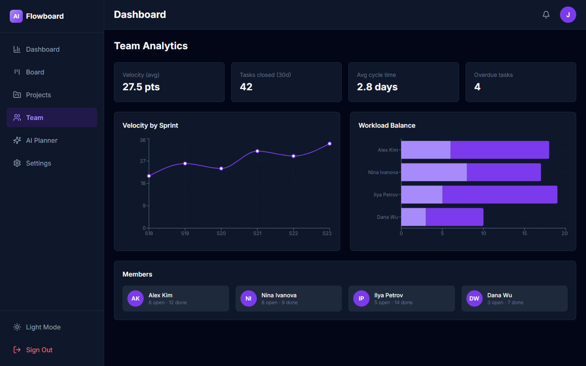

# Flowboard — Project Management SaaS

Fast project management: drag-and-drop kanban boards, tasks with subtasks/comments/labels, activity log, team analytics (velocity, workload), and an AI Planner that decomposes features into subtasks and drafts phased project plans.

## Tech Stack
Next.js 15 (App Router), React 19, TypeScript, Tailwind CSS, Supabase (PostgreSQL + Auth + RLS), OpenAI API (mock-first), Recharts, Zod.

## Features
- 📋 Kanban board: native HTML5 drag-and-drop, assignee filter, priority dots, label chips, subtask/comment counters
- 🗂 Projects with progress and at-risk status
- 📊 Team analytics: velocity by sprint, workload balance, cycle time
- 🤖 **AI Planner**: feature → subtasks with hour estimates; goal → phased plan with milestones (timeline UI)
- 📝 Activity log (who/what/when) on dashboard and in schema
- 🔐 Roles admin/member/guest with RLS (guests are read-only)
- 🌙 Dark/light theme, responsive

## Quick Start
```bash
npm install
cp .env.example .env.local
# Run sql/schema.sql in Supabase SQL editor
npm run db:seed
npm run dev
```

## Demo Credentials
`demo@example.com` / `Demo123!` (create in Supabase Auth dashboard, then seed).

## Deployment
Supabase (schema + seed) → Vercel (env vars) → deploy. See [DEPLOYMENT.md](DEPLOYMENT.md).

## License
MIT

## Как пользоваться (Usage guide)

### 1. Лендинг

Обзор инструмента. Вход: `demo@example.com / Demo123!`.

### 2. Kanban-доска

Перетаскивайте карточки между колонками мышью. На карточке: точка приоритета, цветные метки, счётчики подзадач и комментариев, аватар исполнителя, дедлайн. Фильтр по исполнителю сверху.

### 3. AI-планировщик

Опишите фичу → **Decompose** — список подзадач с оценками в часах и суммой. Опишите цель проекта → **Generate Plan** — фазы с задачами и вехами на timeline. Работает без API-ключей.

### 4. Аналитика команды

Velocity по спринтам и баланс нагрузки (открытые/закрытые задачи по каждому участнику) — перекосы видны до выгорания.
